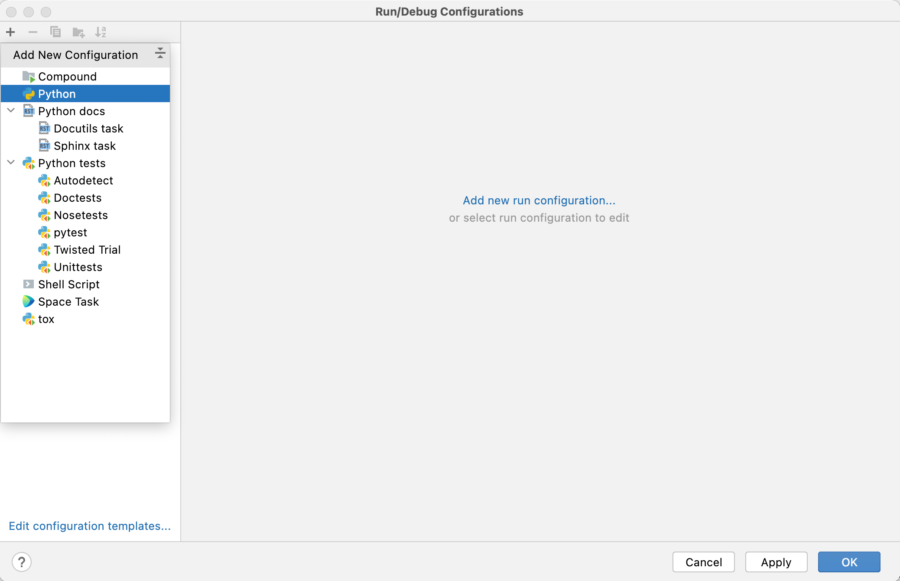
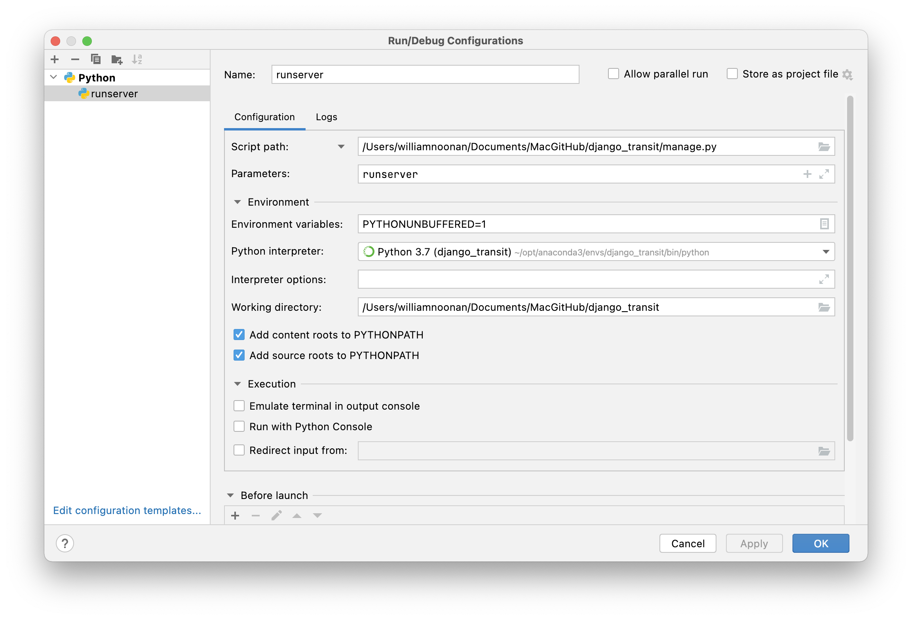
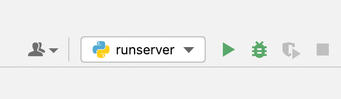

# Django Smart Map Project

### Installation
1. Download PyCharm
2. Fork this project from PyCharm
3. Open a terminal in PyCharm and execute the following
   1. pip install django
   2. pip install python-socketio
4. (Optional) insert Google API key near bottom of django_transit/settings.py

### Run the Server
In a PyCharm terminal execute the following
<li>python manage.py runserver

### Debugging
Click 'Add Configuration...' at top of PyCharm window.

  
Click the "+" symbol at the top left. Select 'Python'.

  
Setup the configuration as shown. Set 'Script path' to your project's manage.py script.

  
Click in a file's gutter to add a breakpoint.

  
Click the green bug icon to run the server in debug mode. (You can use the green play button for regular mode.)

